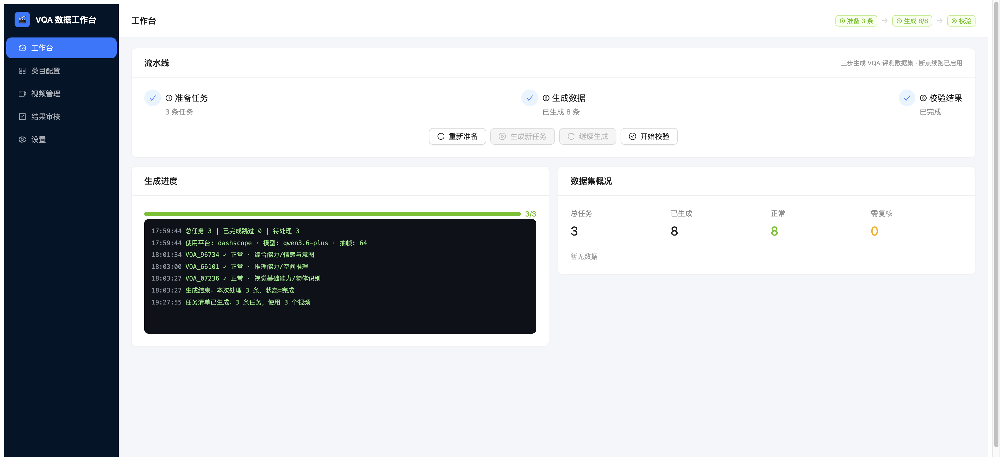
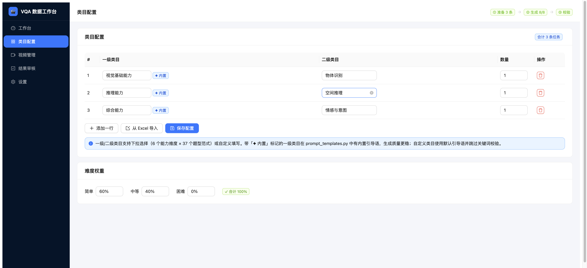
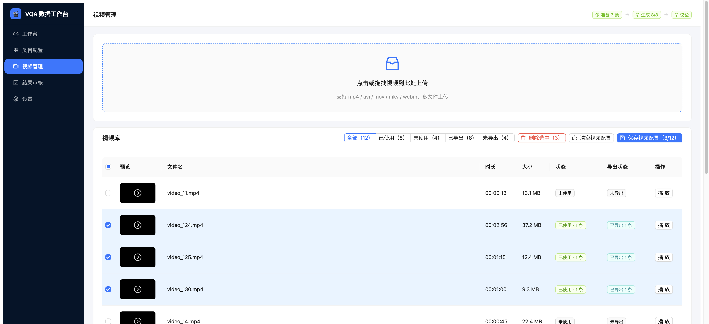
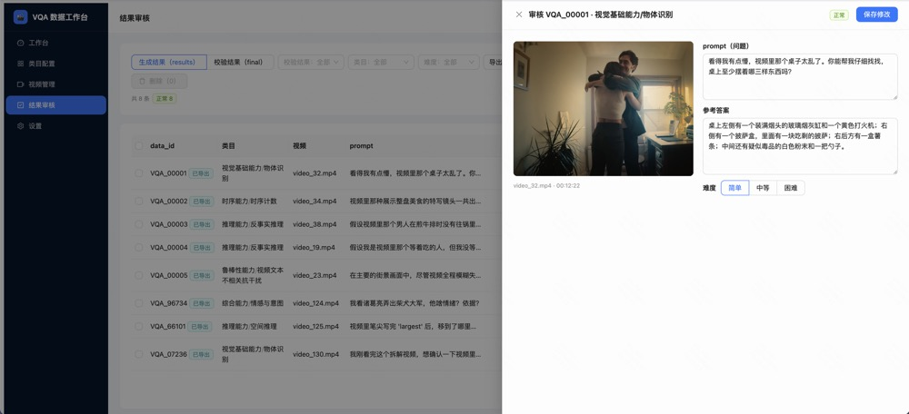
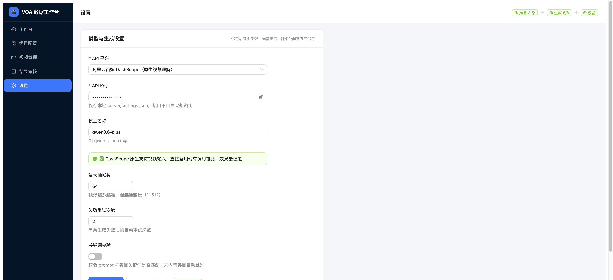

# 🎬 VQA 评测数据自动生成器

> 浏览器里点几下，把视频批量变成 VQA 评测数据集

**告别手工 Excel、终端敲命令、结果难复核** —— 基于VLM大模型，从视频自动生成「问题 + 参考答案 + 难度」，全流程在浏览器中完成。

- 🖥 **全部操作在浏览器**：配置类目、勾选视频、启动生成、审核结果
- 📊 **生成过程实时可见**：进度条 + 滚动日志 + 断点续跑，长任务随时停止、随时续跑
- 🎯 **边播视频边审核**：结果与视频对照，在线修改 prompt/答案，一键导出 Excel



## 🚀 三步启动

```bash
# 1. 克隆项目（前端已内置，无需 npm）
git clone https://github.com/shadow11206/Automatic-Construction-of-Evaluation-Data.git
cd Automatic-Construction-of-Evaluation-Data

# 2. 安装后端依赖（首次）
pip install -r requirements.txt

# 3. 启动
python server/main.py
```

浏览器打开 **http://localhost:8000** 即可使用。

> 首次使用：到「设置」页填入你的 API Key（存本地，不进 git）。未配置 Key 时界面、准备、校验功能正常，仅「生成数据」会提示配置。

## 🖥 五大页面

### 1. 工作台 —— 三步流水线一键执行

准备 → 生成 → 校验，实时进度与日志一目了然。生成中断后可一键「继续生成」从断点续跑，换新视频时自动切换到「生成新任务」，不会误覆盖旧结果。


### 2. 类目配置 —— 可视化编辑，支持 Excel 导入

类目/数量/难度权重在线编辑，内置类目提示；也可从 Excel 导入（追加/覆盖预览），彻底告别手改 xlsx。



### 3. 视频管理 —— 上传、预览、勾选一气呵成

拖拽上传视频、在线播放预览、勾选参与评测；按「已使用/未使用/已导出/未导出」筛选，删除有引用警告。



### 4. 结果审核 —— 边播视频边审

多维筛选、边播视频边审核，在线改 prompt/答案、批量标记重跑/删除，导出 Excel 所见即所得。



### 5. 设置 —— 多平台 API 一键切换

DashScope / OpenAI / OpenRouter / 智谱 / 自定义兼容接口，各自独立保存 Key 与模型，一键连通性测试。



## ⭐ 核心能力

| 能力 | 说明 |
|------|------|
| **断点续跑** | 按「任务+视频+类目」指纹跳过已完成条目，中断后一键继续，绝不重复消耗 |
| **数据零覆盖** | 换视频/改配置后新任务自动追加，历史结果永远保留（data_id 与视频绑定） |
| **多平台模型** | DashScope 原生视频理解；OpenAI 兼容平台自动「抽帧 + 图片」调用 |
| **生成可停止** | 长任务随时停止，已生成结果即时落盘 |
| **类目 Excel 导入** | 追加/覆盖两种模式，导入前预览 |
| **结果导出** | 审核结果一键导出 Excel，含已导出/未导出状态追踪 |
| **在线编辑** | 审核页直接改 prompt/答案/难度，标记重跑 |

## 🔐 配置与安全

- API Key 仅存本地 `server/settings.json`（已 gitignore，不会进仓库）
- 接口返回一律掩码（`sk-****4fe6`），代码中无明文密钥
- 生成/校验不修改原 CLI 文件，Web 与命令行可混用同一份数据

## 🗂 项目结构

```
├── server/                  # Web 后端（FastAPI）
│   ├── main.py              #   入口：API 路由 + 静态托管前端
│   ├── store.py             #   数据读写层（xlsx/json/settings）
│   ├── jobs.py              #   后台任务执行器（进度/断点续跑/停止）
│   └── vl_adapter.py        #   多平台模型调用适配层
├── web/                     # Web 前端（React + Ant Design，构建产物随仓库内置）
│   └── src/pages/           #   工作台/类目配置/视频管理/结果审核/设置
├── docs/screenshots/        # README 截图
├── prepare_tasks.py         # CLI 步骤①：配置 → 任务清单（Web 复用其分配逻辑）
├── generate_vqa.py          # CLI 步骤②：逐视频调 Qwen VL 生成（Web 复用）
├── validate.py              # CLI 步骤③：校验 → 最终数据集（Web 复用）
├── prompt_templates.py      # Prompt 模板 + 类目引导语映射（扩展类目改这里）
├── video_utils.py           # 视频抽帧 + DashScope API 封装
├── category_config.xlsx     # 类目配置（Web 可在线编辑）
├── video_list.xlsx          # 参与评测的视频清单（Web 可勾选）
├── videos/                  # 视频文件目录
├── tasks.json               # 中间产物：任务清单
├── results.json / results.csv    # 中间产物：生成结果
└── final.json / final.csv        # 最终产物：校验后数据集
```

**数据流**：`category_config.xlsx + video_list.xlsx → tasks.json → (调 Qwen VL) → results.json → validate → final.json/csv`

---

## 附录 A：命令行使用（CLI）

Web 工作台覆盖全部功能，CLI 适合脚本化/批处理场景。Web 与 CLI 共用同一份数据文件，可混用。

```bash
# 环境：Python 3.9+，安装依赖后
pip install -r requirements.txt

# 设置 API Key（DashScope）
export DASHSCOPE_API_KEY="你的密钥"

# 三步运行
python prepare_tasks.py    # ① 准备任务清单（不调模型）
python generate_vqa.py     # ② 批量生成 VQA 数据（调模型，每条 5~30s）
python validate.py         # ③ 校验结果（不调模型）
```

**输入文件**（与 Web 一致）：

| 文件 | 说明 |
|------|------|
| `category_config.xlsx` | 三列：一级类目 / 二级类目 / 数量 |
| `video_list.xlsx` | 第一列：参与评测的视频文件名 |
| `videos/` | 视频文件（mp4/avi/mov 等） |

**输出文件**：

| 文件 | 内容 |
|------|------|
| `tasks.json` | 任务清单（data_id、类目、视频、目标难度） |
| `results.json / results.csv` | 生成结果（prompt、参考答案、难度、状态） |
| `final.json / final.csv` | 校验后最终数据集（追加校验结果、问题详情） |

**断点续跑**：`generate_vqa.py` 自动跳过状态为「正常」的已完成条目；只重跑部分条目时，删除 `results.json` 中对应条目后重跑即可。

## 附录 B：常见问题

**Q1：我没有阿里云百炼的 API Key 怎么办？**
到「设置」页可配置其他平台（OpenAI/OpenRouter/智谱/自定义），无需 DashScope。

**Q2：生成一条数据要多久 / 多少钱？**
每条 5~30 秒（取决于视频时长与抽帧数，可在设置页调整），费用取决于所选模型的计费。

**Q3：生成到一半停了，要重新开始吗？**
不用。已生成的结果会即时落盘，点「继续生成」从断点续跑；生成/停止按钮会按当前状态自动切换，不会误覆盖旧结果。

**Q4：同一个视频可以生成多条不同的问题吗？**
可以。类目配置中该视频会按数量分配多条任务，自动覆盖不同类目与难度。

**Q5：生成的问题质量不高怎么办？**
在「结果审核」页边播视频边修改 prompt/答案，改完重新校验即可；也可在「设置」页调整抽帧数、重试次数后标记重跑。

**Q6：程序中途报错退出了怎么办？**
断点续跑会跳过已完成条目，重新启动后自动继续；「结果审核」页也可按需删除个别条目单独重跑。

**Q7：最终 CSV 用 Excel 打开中文乱码怎么办？**
导出的 CSV 使用 UTF-8 with BOM 编码，Excel 直接打开即可，一般不会乱码。

**Q8：我可以把 final.csv 直接拿去用吗？**
可以。final.csv 是校验后的最终数据集，可直接用于评测；「结果审核」页导出 Excel 则为所见即所得的精美版本。
